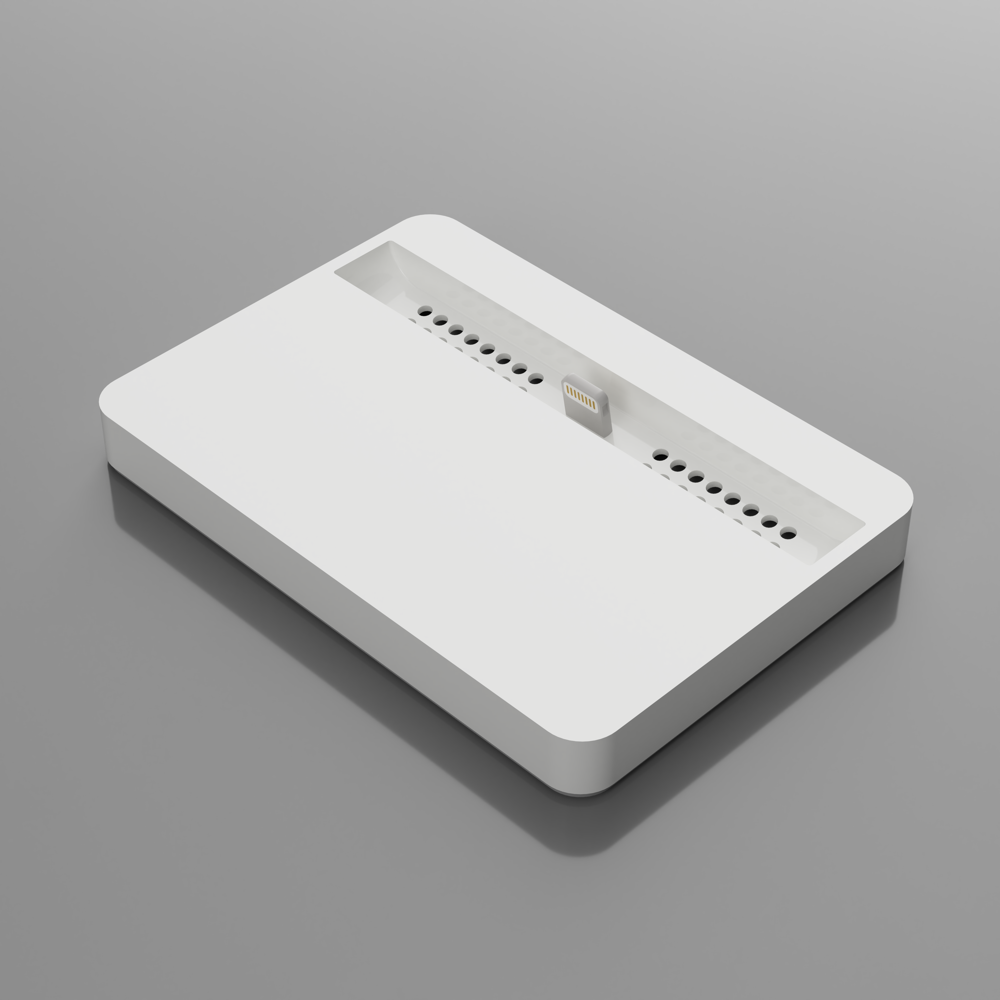
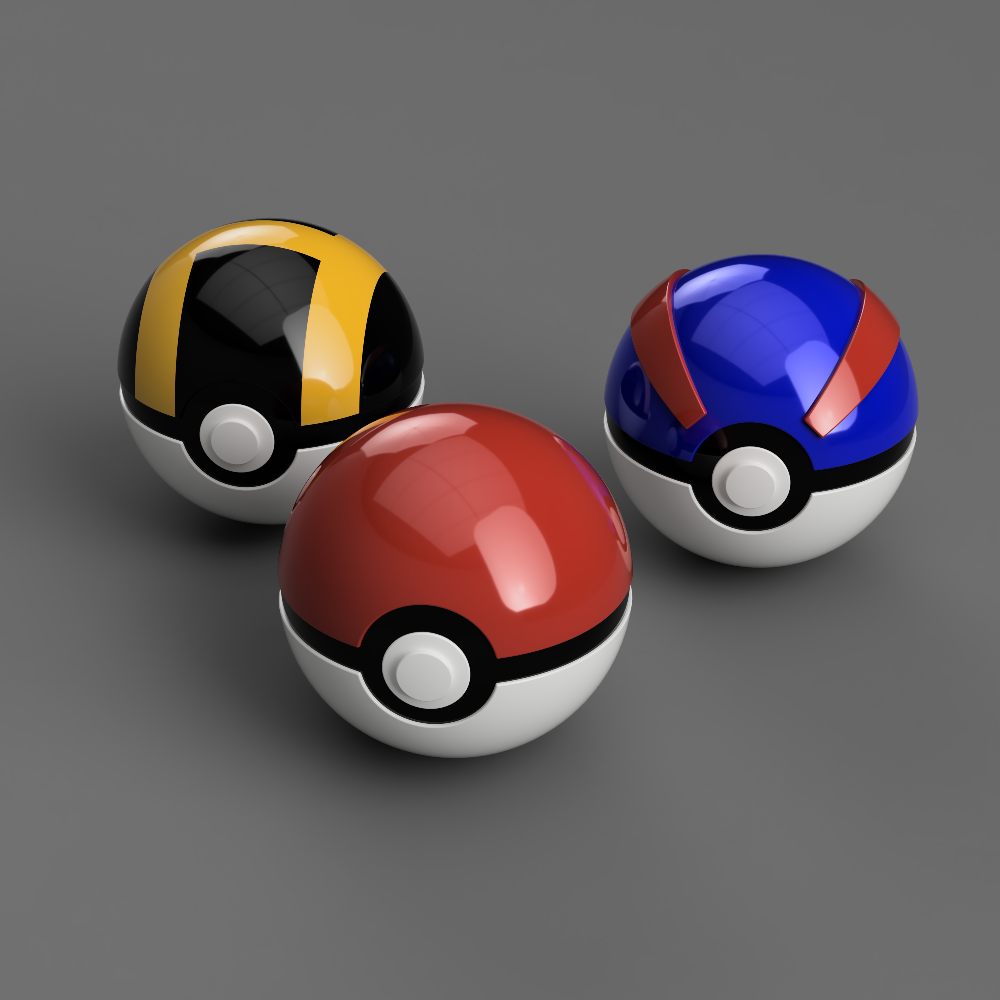
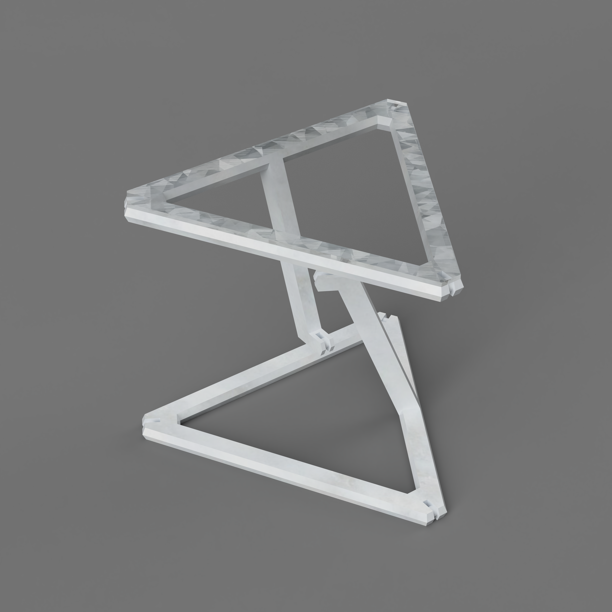
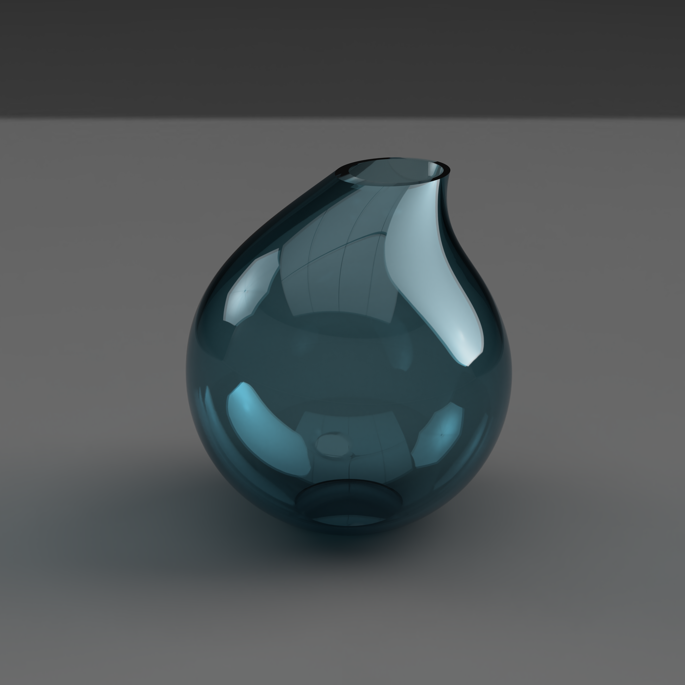
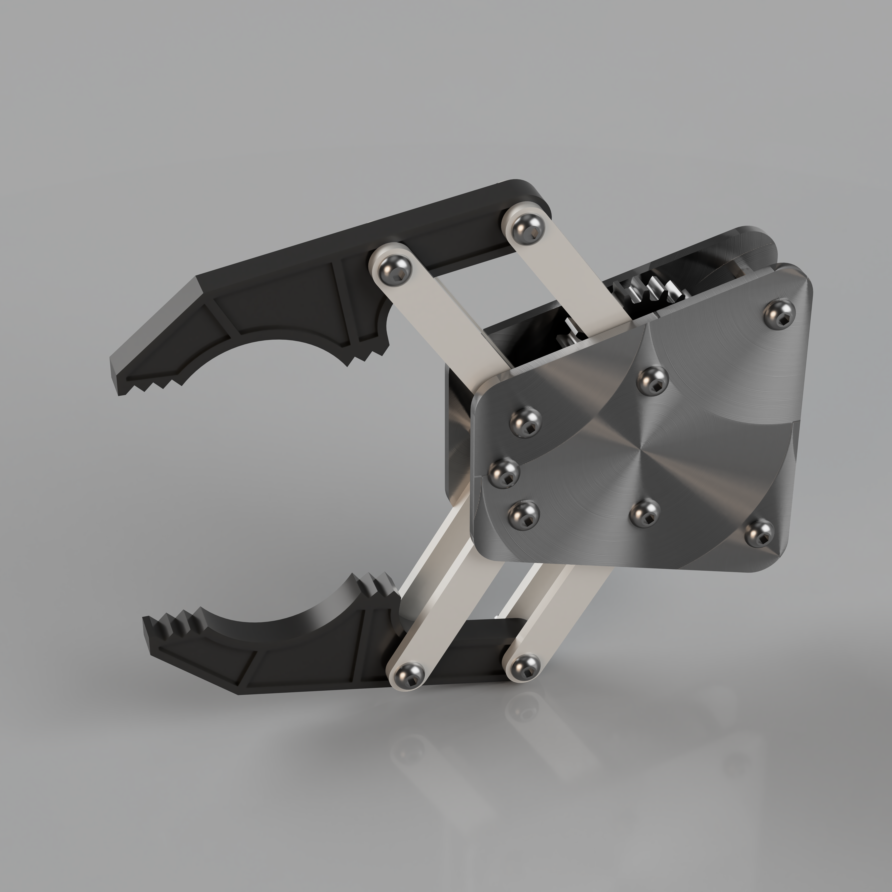
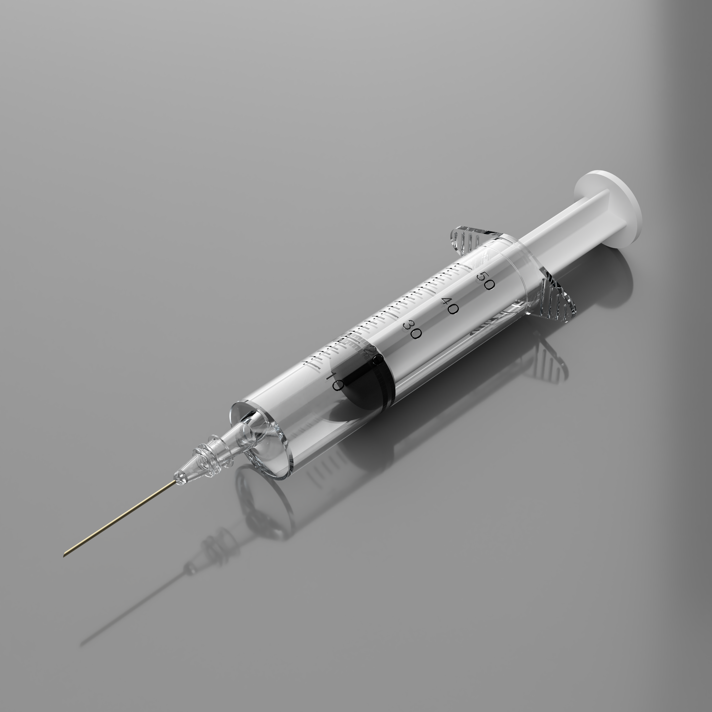
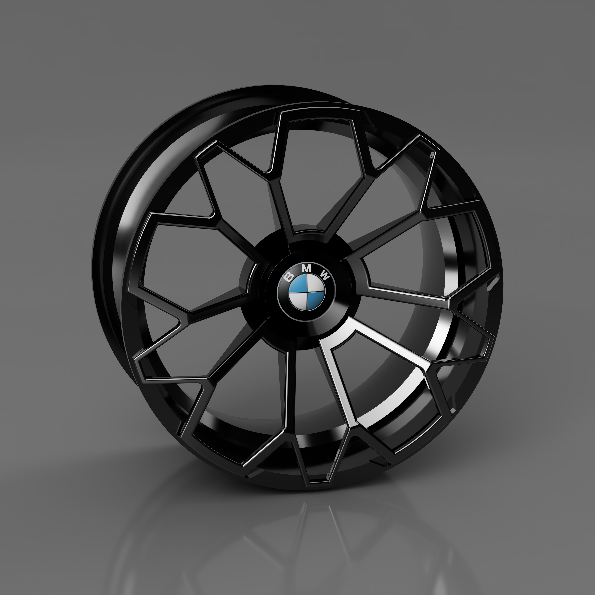
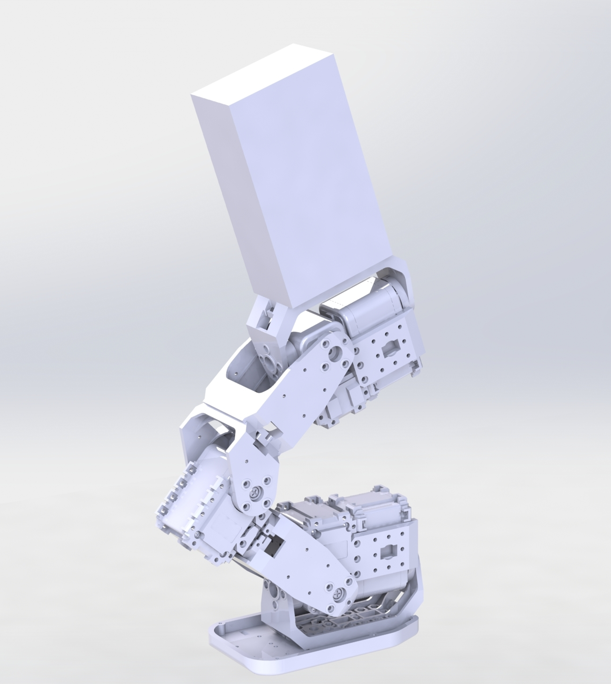
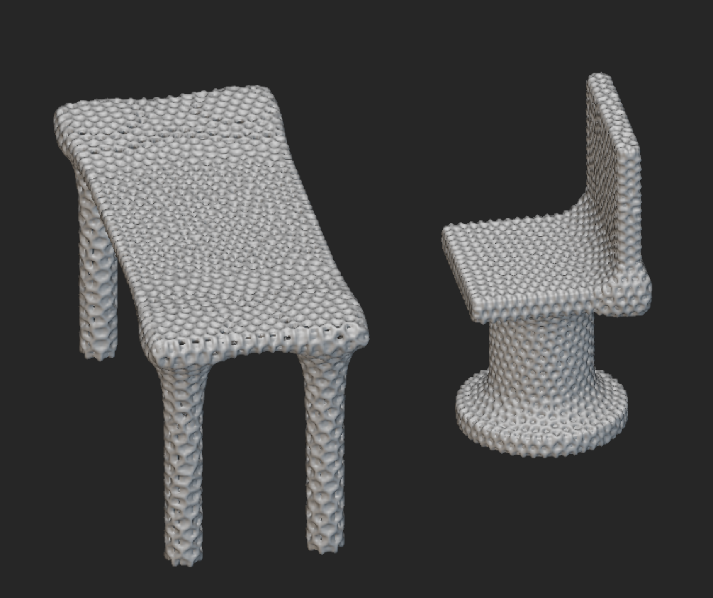

# CAD Projects Showcase

Welcome to my repository of 3D modeling work. This collection displays both functional objects and creative designs.

## Projects Overview

- **Columbia Mug**
  
  

- **iPhone Stand**

  

- **Pokeballs**
  
  

- **Telstar Soccer Ball**
  
  

- **Tensegrity Table**
  
  

- **Waterdrop Vase**
  
  

- **Gripper**

  

- **Syringe**
  
  
  

- **Wheel Rim**
  
  

- **Humanoid Leg**
  
  

- **Topology Optimization**
  
  
  
  [Topology Optimization (PDF)](https://github.com/simonhwk/DM-topology-optimization/blob/main/Topology%20Optimization.pdf)

## Contact

For inquiries or collaborations, contact me at [simon.kang@columbia.edu](mailto:simon.kang@columbia.edu).

---

Enjoy exploring my designs!
