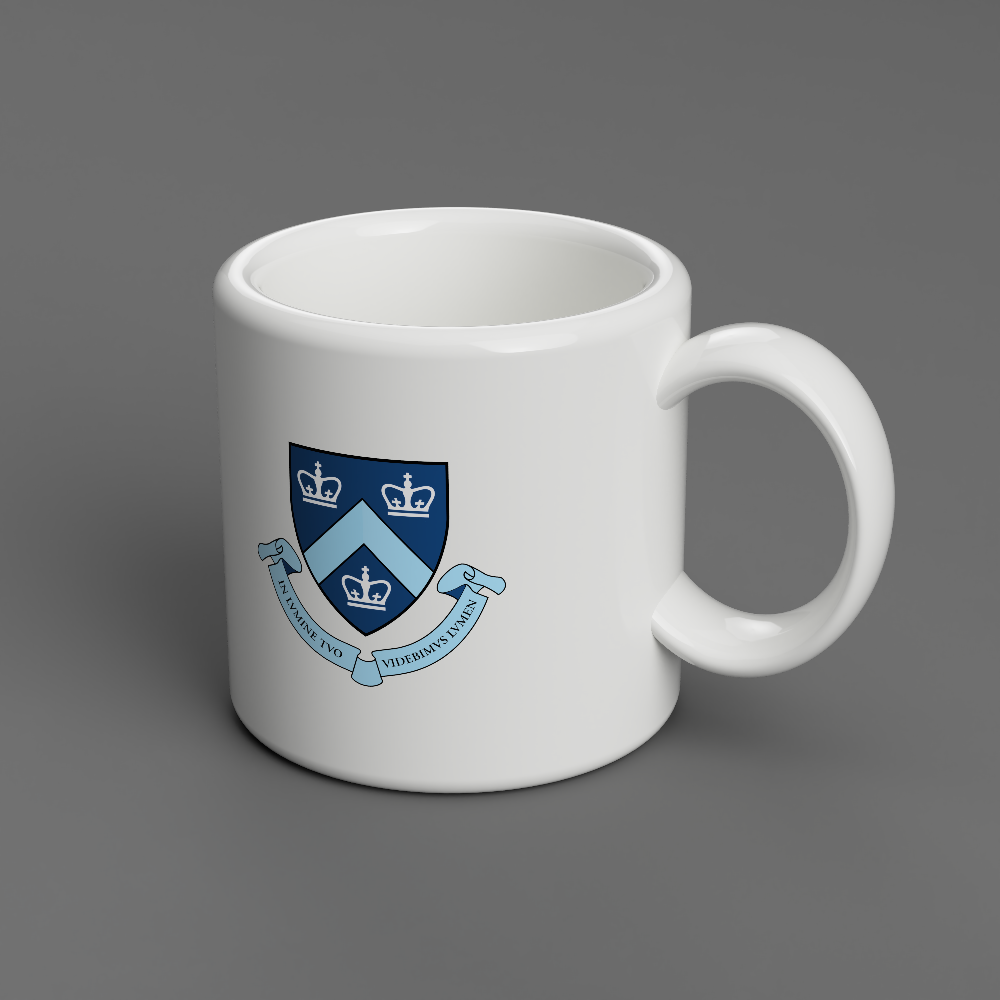

# CAD Projects Showcase

Welcome to my repository of 3D modeling work. This collection includes a variety of CAD files, representing both functional objects and creative designs.

## Projects Overview

- **Columbia Mug**
  

- **Pokeballs**
  

- **Telstar Soccer Ball**
  

- **Tensegrity Table**
  

- **Topology Optimization**
  [Topology Optimization](Topology_Optimization.pdf)

- **Waterdrop Vase**
  

## Contributing

Feel free to fork this repository and modify the CAD files. For any suggestions or improvements, please open a pull request or issue.

## License

This project is licensed under the MIT License - see the [LICENSE.md](LICENSE) file for details.

## Contact

For inquiries or collaborations, contact me at [myemail@example.com](mailto:myemail@example.com).

---

Enjoy exploring my designs!
